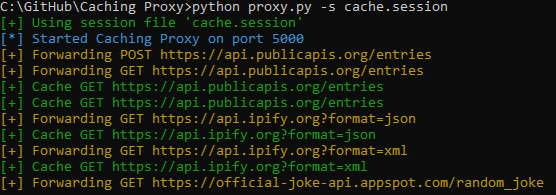

# Caching Proxy

The Caching Proxy is a Python-based lightweight proxy to support developers programming against rate-limited third-party
APIs. It's build to intercept all requests and respond with data from cache, or forward the request to the target host
if it hasn't seen this request yet.



## Running the proxy
### Docker
The easiest way to get started is to use prebuilt docker image. The following command starts the proxy on port 5000:
```shell
docker run -p "5000:5000" robinvandenhurk/cache-proxy
```

If you want to use a local session file you must mount it to the container:
```shell
docker run -p "5000:5000" -v "/tmp/cache.session:/cache.session" robinvandenhurk/cache-proxy
```

### From source
You can also run the proxy from source. First, clone the repo and install the requirements:
```shell
git clone https://github.com/RobinvandenHurk/cache-proxy.git
cd cache-proxy
pip install -r requirements.txt
```

Then start the proxy:
```shell
python3 proxy.py
```

## Usage
Once you started the proxy it is ready to go. Simply append `http://localhost:5000` to your original request to make the request flow through the proxy. For example, if your original request is like this:
```shell
curl https://catfact.ninja/fact
```
Your new request would be like this:
```shell
curl http://localhost:5000/https://catfact.ninja/fact
```

## Why would you need this?

You may want to use this proxy if you are tasked with programming against a third-party API that applies rate-limiting.
During development you can easily send a bunch of requests which ultimately gets you (temporary) blocked, which may
drastically impact your productivity.

This simple proxy intercepts your requests and stores them in cache so that when you repeat the request, the proxy will
respond with the cached response rather than forwarding your request to the actual target host.

## What can you use this for?

This proxy was build to intercept API calls and respond from cache if possible. That means you can use it for most API
calls. However, it does not play nice with binary responses, like images. The primary focus of this proxy currently lies
in handling text based payloads, though binary support may be added later.

## Contributing

If you desire some changes or new features in this server you generally have two options:
* Build it yourself and create a pull request (Please do :)
* Create an issue describing (very clearly) what it is that you want

## TODO

* Improve cache strategies (Right now read from cache based on HTTP method and URL)
